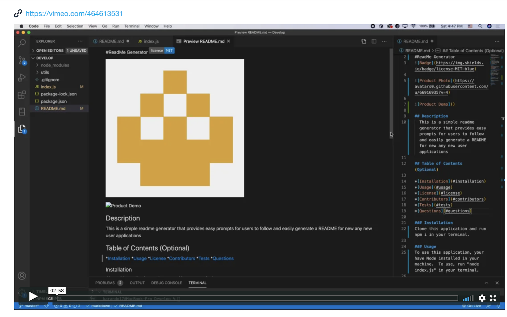

#README Generator

## Product Demo

## Description 
This is a readme generator with prompts for users to follow and easily generate a README for new apps

## Table of Contents (Optional) 

*[Installation](#installation)
*[Usage](#usage)
*[License](#license)
*[Contributors](#contributors)
*[Tests](#tests)
*[Questions](#questions)

### Installation
Clone this app and run "npm i" in your terminal

### Usage
In order to use this app, you must have Node installed in your machine. To use run "node index.js" in your terminal.

### License
MIT

### Contributors
This app was created with the help of a TA and a tutor.

### Tests
For testings, run "npm test" in your terminal.

### Questions

#### Github
katrinamaris17